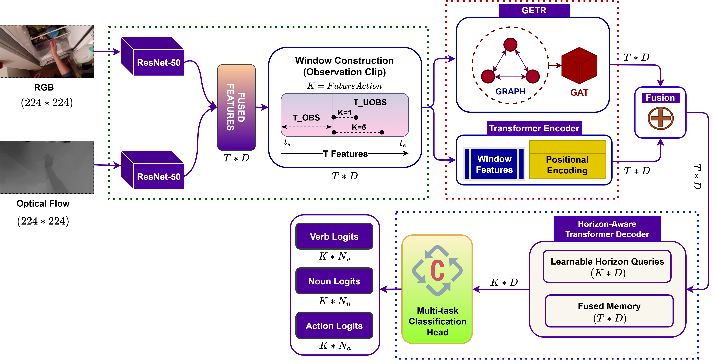

# EgoHAnG: Graph-Enhanced Horizon Aware Egocentric Action Anticipation

[](https://icpr2026.org/)
[](https://www.python.org/)
[](https://pytorch.org/)
[](LICENSE)

> **Pawanesh Kumar Vishwakarma, Ananda S. Chowdhury, Abhimanyu Sahu**  
> MNNIT Allahabad · Jadavpur University  
> ICPR 2026 — Paper ID 911

---

## Overview

EgoHAnG is an end-to-end framework for egocentric action anticipation that integrates:

1. **Early multimodal fusion** — RGB + Optical Flow via pretrained ResNet-50 + PCA
2. **Graph-Enhanced Temporal Reasoning (GETR)** — k-NN similarity graph + Graph Attention Network (GAT) to capture inter-frame relationships, fused with a Transformer encoder for global temporal context
3. **Horizon-Aware Transformer Decoder (HATD)** — learnable horizon-specific queries to independently predict verb, noun, and action at multiple future anticipation times



---

## Results

### EPIC-Kitchens

| Method | Top-1 Verb | Top-1 Action | Top-5 Action | Top-5 Recall |
|--------|-----------|-------------|-------------|-------------|
| RULSTM (ICCV'19) | 33.04 | 14.39 | 33.73 | 13.30 |
| InAViT (WACV'24) | 49.14 | 23.75 | — | 25.89 |
| **EgoHAnG (Ours)** | **50.85** | **24.40** | **35.64** | **28.71** |

### EGTEA Gaze+

| Method | Top-1 Verb | Top-1 Noun | Top-1 Action | Top-5 Recall |
|--------|-----------|-----------|-------------|-------------|
| InAViT (WACV'24) | 79.30 | 77.60 | 67.80 | 58.20 |
| **EgoHAnG (Ours)** | **89.22** | **82.67** | **71.40** | **70.03** |

---

## Repository Structure

```
EgoHANG/
├── extract_features.py     # Step 1: Feature extraction
├── train.py                # Step 2: Training
├── evaluate.py             # Step 3: Evaluation
├── model.py                # Model architecture (GETR + HATD)
├── dataset.py              # Dataset loader
├── requirements.txt        # Python dependencies
├── tools/
│   ├── imports.py          # Common imports
│   ├── pca.py              # PCA utility class
│   └── pca_2048_to_512.pkl # Pretrained PCA model
├── EPIC-Kitchens/
│   └── Labels/             # Action label CSVs per participant
├── Train_Val/              # Training/validation split files
└── Viz_Results/            # Architecture diagrams
```

---

## Installation

### Requirements

- Python 3.9 or higher
- CUDA-compatible GPU (recommended: NVIDIA RTX A4000 or equivalent)
- 16 GB+ RAM

### Step 1 — Clone the repository

```bash
git clone https://github.com/pawanesh-mnnit/EgoHANG.git
cd EgoHANG
```

### Step 2 — Create a virtual environment

```bash
python -m venv egohang_env
source egohang_env/bin/activate        # Linux / macOS
egohang_env\Scripts\activate           # Windows
```

### Step 3 — Install dependencies

```bash
pip install -r requirements.txt
```

For PyTorch Geometric, install the version matching your CUDA:

```bash
# CUDA 11.8
pip install torch-geometric torch-scatter torch-sparse \
    -f https://data.pyg.org/whl/torch-2.0.0+cu118.html

# CUDA 12.1
pip install torch-geometric torch-scatter torch-sparse \
    -f https://data.pyg.org/whl/torch-2.0.0+cu121.html

# CPU only
pip install torch-geometric torch-scatter torch-sparse \
    -f https://data.pyg.org/whl/torch-2.0.0+cpu.html
```

---

## Datasets

### EPIC-Kitchens
Download from the official website: https://epic-kitchens.github.io/

Expected folder structure:
```
/path/to/EPIC_Kitchens/
├── RGB/
│   ├── P01_01/   (frames as .jpg)
│   ├── P01_04/
│   └── ...
└── OpticalFlow/
    ├── P01_01/
    ├── P01_04/
    └── ...
```

### EGTEA Gaze+
Download from: https://cbs.ic.gatech.edu/fpv/

Expected folder structure:
```
/path/to/EGTEA/
├── RGB/
│   ├── OP01-R01-PastaSalad/
│   └── ...
└── Flow/
    ├── OP01-R01-PastaSalad/
    └── ...
```

---

## Pretrained Models

Download pretrained model weights from the GitHub Release:

**[Download from GitHub Releases v1.0.0](https://github.com/pawanesh-mnnit/EgoHANG/releases/tag/v1.0.0)**

| File | Dataset | Size |
|------|---------|------|
| `P01_04_fused_model_PCA.pth` | EPIC-Kitchens (P01_04) | 272 MB |
| `P01_04_Fused_model.pth` | EPIC-Kitchens (P01_04) | 272 MB |
| `P01_05_Fused_model.pth` | EPIC-Kitchens (P01_05) | 274 MB |
| `OP01-R01-PastaSalad_Fused_model.pth` | EGTEA Gaze+ | 272 MB |
| `OP01-R02-TurkeySandwich_Fused_model.pth` | EGTEA Gaze+ | 272 MB |
| `OP01-R03-BaconAndEggs_Fused_model.pth` | EGTEA Gaze+ | 272 MB |
| `OP01-R04-ContinentalBreakfast_Fused_model.pth` | EGTEA Gaze+ | 272 MB |
| `OP01-R05-Cheeseburger_Fused_model.pth` | EGTEA Gaze+ | 272 MB |

Place downloaded `.pth` files in a `checkpoints/` folder.

---

## Usage

### Step 1 — Extract Features

```bash
# EPIC-Kitchens
python extract_features.py \
    --dataset epic_kitchens \
    --rgb_root /path/to/EPIC_Kitchens/RGB \
    --flow_root /path/to/EPIC_Kitchens/OpticalFlow \
    --labels_root EPIC-Kitchens/Labels \
    --output_root EPIC-Kitchens/Features \
    --pca_path tools/pca_2048_to_512.pkl

# EGTEA Gaze+
python extract_features.py \
    --dataset egtea \
    --rgb_root /path/to/EGTEA/RGB \
    --flow_root /path/to/EGTEA/Flow \
    --labels_root EGTEA/Labels \
    --output_root EGTEA/Features \
    --pca_path tools/pca_2048_to_512.pkl
```

### Step 2 — Train

```bash
# EPIC-Kitchens
python train.py \
    --dataset epic_kitchens \
    --fused_csv EPIC-Kitchens/Features/P01_04_fused_features_PCA.csv \
    --label_csv EPIC-Kitchens/Labels/P01_04.csv \
    --save_path checkpoints/P01_04_model.pth

# EGTEA Gaze+
python train.py \
    --dataset egtea \
    --fused_csv EGTEA/Features/OP01-R01_fused_features_PCA.csv \
    --label_csv EGTEA/Labels/OP01-R01.csv \
    --save_path checkpoints/OP01-R01_model.pth
```

### Step 3 — Evaluate with Pretrained Weights

```bash
# EPIC-Kitchens
python evaluate.py \
    --dataset epic_kitchens \
    --fused_csv EPIC-Kitchens/Features/P01_04_fused_features_PCA.csv \
    --label_csv EPIC-Kitchens/Labels/P01_04.csv \
    --model_path checkpoints/P01_04_fused_model_PCA.pth

# EGTEA Gaze+
python evaluate.py \
    --dataset egtea \
    --fused_csv EGTEA/Features/OP01-R01_fused_features_PCA.csv \
    --label_csv EGTEA/Labels/OP01-R01.csv \
    --model_path checkpoints/OP01-R01-PastaSalad_Fused_model.pth
```

---

## Hyperparameters

| Parameter | Value |
|-----------|-------|
| Observation Window (T_obs) | 90 frames |
| Anticipation Horizons | 2.0, 1.75, 1.50, 1.25, 1.0, 0.75, 0.50, 0.25 s |
| Feature Dimension | 512 (after PCA) |
| k-NN Graph Neighbours | 5 |
| GAT Layers | 3 |
| GAT Heads | 8 |
| Transformer Layers | 3 |
| Batch Size | 8 |
| Optimizer | Adam |
| Learning Rate | 1e-4 |
| Weight Decay | 1e-4 |
| Epochs | 100 |
| Dropout | 0.1 |
| RGB Fusion Weight (α) | 0.6 |
| Flow Fusion Weight (1-α) | 0.4 |

---

## Model Efficiency

| Method | GFLOPs | Parameters | Latency |
|--------|--------|-----------|---------|
| InAViT (WACV'24) | 391 | 157.2M | — |
| EgoHAnG w/o PCA | 600 | 398.1M | 21.58 ms |
| **EgoHAnG (Ours)** | **150** | **26.3M** | **19.34 ms** |

*Latency measured on NVIDIA RTX A4000 GPU, averaged over 100 runs.*

---


## License

This project is released under the [MIT License](LICENSE).

---

## Contact

- Pawanesh Kumar Vishwakarma — pawanesh.2023rcs04@mnnit.ac.in
- Abhimanyu Sahu — abhimanyus@mnnit.ac.in

